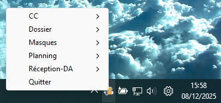
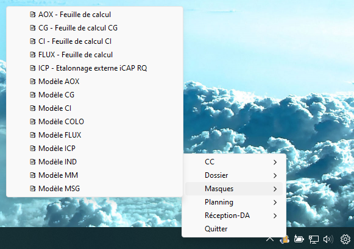

# Portfolio Python 🐍
Bienvenue sur mon espace public où je présente mes différents programmes en Python

---------------------------------------------------------------------------------------------------
## 🔧 Automatisation Systray
Ce programme crée un menu contextuel dynamique dans la barre système pour ouvrir automatiquement des raccourcis regroupés dans des sous-menus. Il gère plusieurs dossiers, ajoute des emoji adaptés à chaque catégorie et assure une fermeture propre sans erreurs.

## 📸 Captures d’écran

