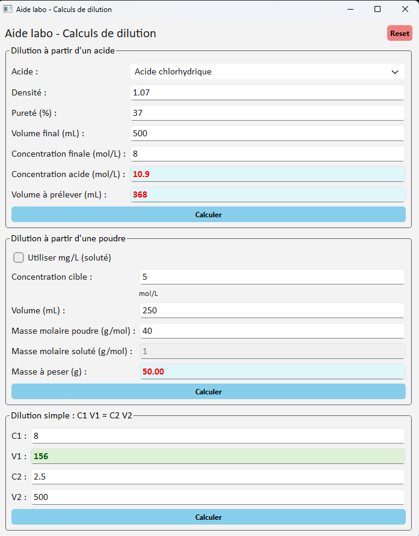

# 🧪 Aide Labo – Calculateur de dilutions et volumes

Aide Labo est un outil Python conçu pour faciliter les calculs de dilution, de concentration et de volumes à prélever en laboratoire.  
Il permet d’éviter les erreurs de calcul, d’accélérer la préparation des solutions et d’uniformiser les pratiques.

---

## ✨ Fonctionnalités

- Calcul automatique des dilutions à partir d’un soluté (acide commercial, poudre, solution mère, etc.)
- Calcul des volumes à prélever selon la concentration souhaitée
- Calcul des concentrations finales après dilution
- Gestion des unités courantes (mg/mL, %, g/L…)
- Interface simple en ligne de commande
- Résultats clairs, immédiats et sans risque d’erreur

## 🖼️ Exemple d’utilisation

👉 [Voir le code source](py/aidelabo.py)
